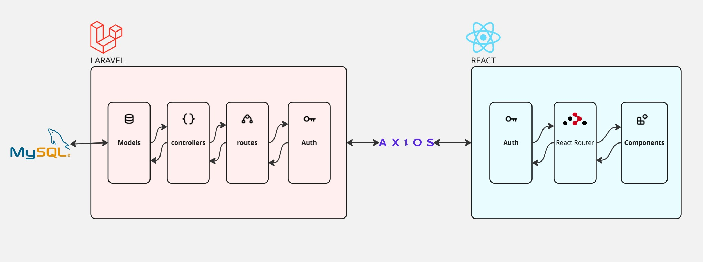
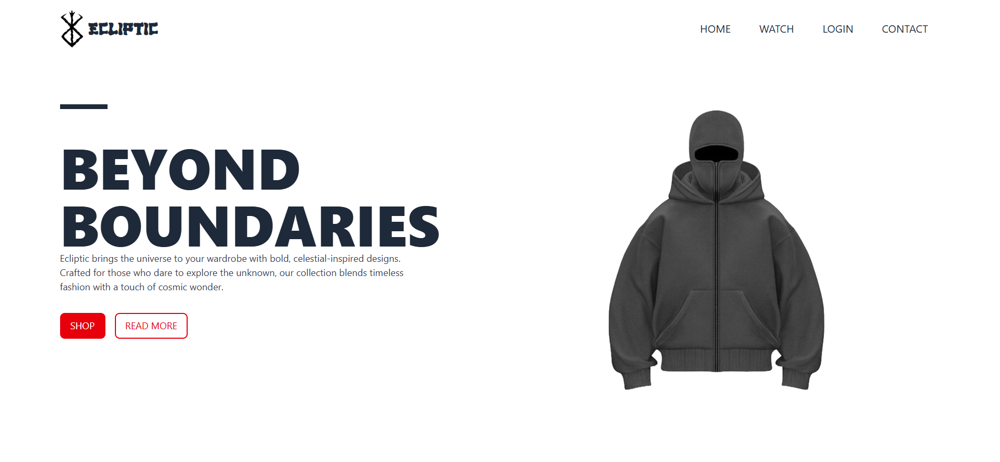
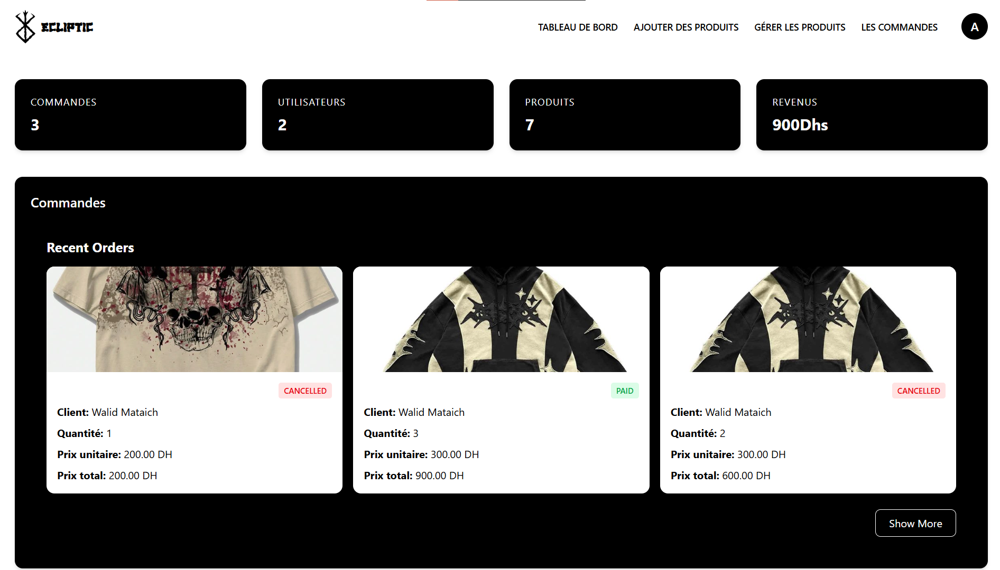

# Ecliptic - Site E-Commerce de Marque

Bienvenue sur **Ecliptic**, une plateforme e-commerce moderne et responsive développée avec **Laravel** pour l’API backend et **React.js** pour le frontend. Ce projet illustre un **développement full-stack** avec des fonctionnalités avancées telles que les **opérations CRUD**, l’**authentification**, des **APIs RESTful**, et une **présentation dynamique des produits**, spécialement conçue pour les passionnés de mode.

---

## Architecture



## Landing Page



## Dashboard Administrateur



---

## 🚀 Fonctionnalités

### 🛠️ Espace Administrateur

- ✏️ CRUD complet pour les produits, catégories et utilisateurs
- 📊 Tableau de bord avec statistiques
- 🧩 Gestion des rôles (administrateur vs utilisateur)
- 📥 Téléchargement d'images de produits (avec validation)

### ✅ Côté Utilisateur

- 🔐 Inscription et connexion sécurisées
- 👕 Consultation et filtrage des produits par catégories
- 🛒 Ajout de commandes, possibilité de payer immédiatement ou plus tard, annulation des commandes
- 📦 Suivi des commandes et consultation de l’historique

---

## 🧰 Technologies Utilisées

| Stack               | Technologies                  |
| ------------------- | ----------------------------- |
| **Frontend**        | React.js, Axios, React Router |
| **Backend**         | Laravel 12, Sanctum           |
| **Base de données** | MySQL                         |
| **Style**           | Tailwind CSS                  |
| **Auth API**        | Laravel Sanctum               |
| **Outils Dev**      | Postman, VSCode, GitHub       |

---

## ⚙️ Guide d’Installation

### 🔧 Prérequis

- PHP ^8.1
- Composer
- Node.js ^18+
- MySQL
- Git

---

### 🖥️ Installation Backend (Laravel API)

```bash
git clone https://github.com/mehdi-khalloufi/brand--project.git
cd brand--project
cd Backend

# Installer les dépendances
composer install

# Configurer les variables d’environnement
cp .env.example .env
php artisan key:generate

# Configurer la base de données dans le fichier .env et importer le fichier sql
importer le fichier eclipticdatabase.sql dans phpMyAdmin


# Lancer le serveur Laravel
php artisan serve


```

### 🖥️ Installation Frontend (React / Vite )

```bash
cd Frontend

# Installer les dépendances
npm install

# Lancer le serveur de développement
npm run dev


# pour ce connecter :
- pour admin :
email : admin@gmail.com / password : admin1234

- pour customer :
email : mataichwalid2@gmail.com / password : walid123

```
